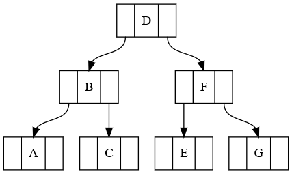

## Project A04
#### Name: Michael Ellerkamp
#### Description: Use GraphViz to draw a binary search tree.

|   #   |    File     |      Description                           |
| :---: | ----------- | -------------------------------------------|
|   1   |   [bst.dot](bst.dot)   | Dot language file that creates a BST image |
|   2   |  [bst.png](bst.png)   | Image of the bst.dot binary search tree.   |
